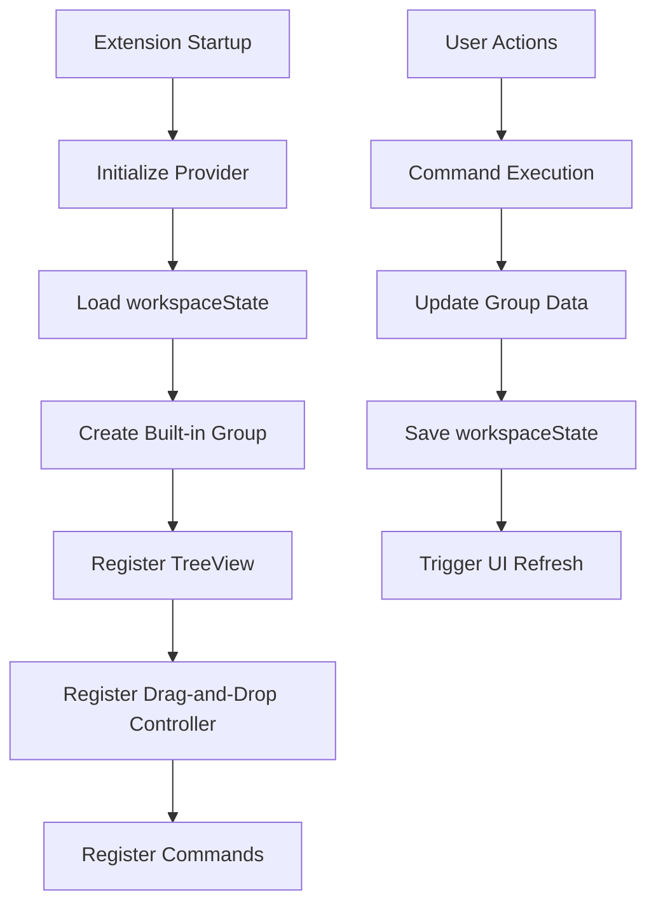
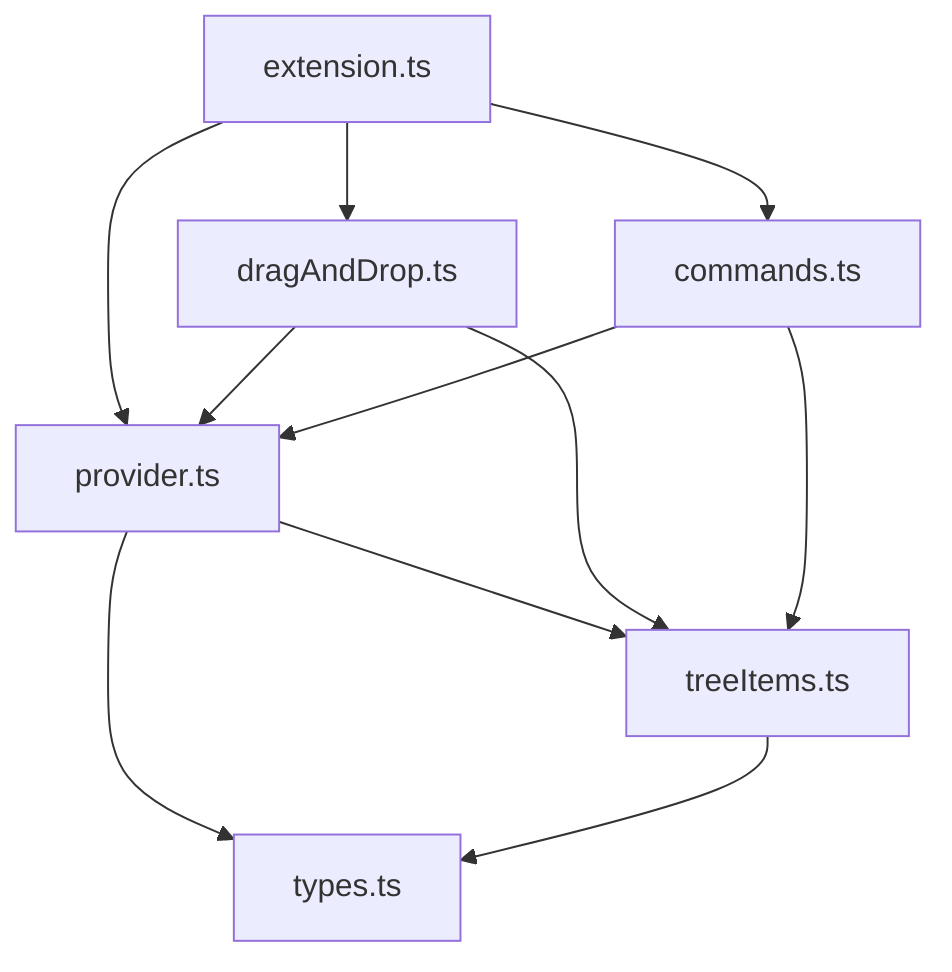
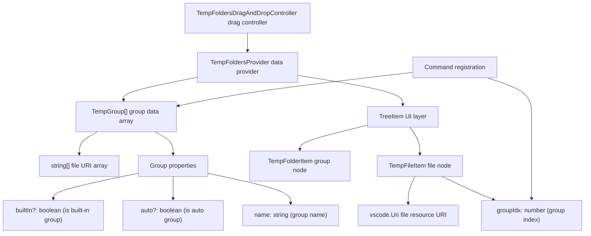
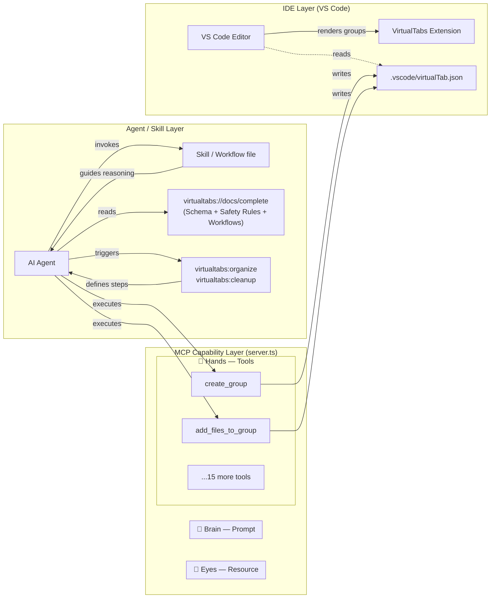

# VirtualTabs Development Guide (Virtual File Directories)

This document provides a complete guide for setting up the development environment and workflow for the VirtualTabs VS Code extension.

---

## 🛠️ Environment Setup

### System Requirements

* **Node.js** (Recommended v16 or above)
* **VS Code** (v1.75.0 or above)
* **TypeScript** (included in devDependencies)

### Setup Steps

#### 1. Project Initialization

```bash
# Clone the project and enter the directory
git clone https://github.com/winterdrive/virtual-tabs.git
cd virtual-tabs

# Install dependencies
npm install
```

#### 2. Compile TypeScript

```bash
# One-time compilation
npx tsc

# Or use npm script
npm run vscode:prepublish
```

#### 3. Start Development Mode

There are two ways to start development mode:

##### Method A: Use VS Code Debugging

1. Open the project folder in VS Code
2. Press `F5` or use the Command Palette (`Cmd+Shift+P` / `Ctrl+Shift+P`)
3. Select "Debug: Start Debugging"
4. A new Extension Development Host window will open

##### Method B: Use Command Line

```bash
# macOS/Linux
code --extensionDevelopmentPath=. --new-window

# Windows
code.cmd --extensionDevelopmentPath=. --new-window
```

#### 4. Live Development & Debugging

##### Start TypeScript Watch Mode

```bash
# Start TypeScript watch mode for auto-compilation
npx tsc --watch

# Or use VS Code tasks
# Press Cmd+Shift+P → "Tasks: Run Task" → "tsc: watch - tsconfig.json"
```

#### Reload the Extension

In the Extension Development Host window:

* Press `Cmd+R` (macOS) or `Ctrl+R` (Windows/Linux) to reload
* Or use Command Palette → "Developer: Reload Window"

#### 5. Debugging Tips

### Set Breakpoints

* Set breakpoints directly in TypeScript source code
* Breakpoints will be active after starting debug mode with F5

### View Debug Information

* Use `console.log()` to output to the Developer Console
* Check the Output panel → "Extension Host" channel
* Use VS Code's Debug Console

### Test Extension Features

1. Open some files in the Extension Development Host window
2. Check the "Virtual Tabs" view in the Explorer panel
3. Test various features (grouping, drag-and-drop, context menu, etc.)

---

## 🛠️ Technical Configuration Details

### package.json Core Configuration

```json
{
    "name": "virtual-tabs",
    "displayName": "VirtualTabs",
    "main": "./dist/extension.js",
    "engines": { "vscode": "^1.75.0" },
    "contributes": {
        "views": {
            "explorer": [{
                "id": "virtualTabsView",
                "name": "VirtualTabs (Virtual File Directories)",
                "icon": "$(tab)"
            }]
        },
        "commands": [
            // 21 registered commands, including group management, file operations, batch processing, etc.
        ],
        "menus": {
            "view/item/context": [
                // Rich context menu configuration, supports conditional display by contextValue
            ]
        }
    }
}
```

### TypeScript Compilation Configuration

```json
{
    "compilerOptions": {
        "target": "ES2020",
        "module": "commonjs",
        "outDir": "dist",
        "rootDir": "src",
        "strict": true,
        "types": ["node", "vscode"]
    }
}
```

### VS Code Development Environment Configuration

#### .vscode/launch.json

```json
{
    "configurations": [{
        "name": "Run Extension",
        "type": "extensionHost",
        "preLaunchTask": "vscode:prepublish",
        "outFiles": ["${workspaceFolder}/dist/**/*.js"]
    }]
}
```

#### .vscode/tasks.json

```json
{
    "tasks": [{
        "label": "vscode:prepublish",
        "command": "npm run vscode:prepublish",
        "group": { "kind": "build", "isDefault": true },
        "problemMatcher": ["$tsc"]
    }]
}
```

---

## 📁 Project Structure

### Directory Overview

```text
virtual-tabs/
├── .vscode/               # VS Code config files
│   ├── launch.json       # Debug configuration (preLaunchTask: vscode:prepublish)
│   └── tasks.json        # Build task configuration
├── dist/                 # TypeScript build output
├── assets/               # Icons and screenshots
│   ├── hero_banner.png   # Hero banner for README
│   ├── nested_groups_demo.png  # Sub-groups feature demo
│   ├── ai_context_demo.png     # AI context export demo
│   ├── copy_menu_demo.png      # Copy menu demo
│   ├── drag_drop_demo.png      # Drag and drop demo
│   ├── bookmarks_feature.png   # Bookmarks feature demo
│   └── virtualtabs_icon_*.png  # Extension icons
├── i18n/                 # Internationalization files
│   ├── en.json          # English translations
│   ├── zh-tw.json       # Traditional Chinese translations
│   └── zh-cn.json       # Simplified Chinese translations
├── src/                  # TypeScript source code
│   ├── extension.ts      # Extension entry (activate/deactivate)
│   ├── types.ts          # Data structure definitions (TempGroup, VTBookmark)
│   ├── treeItems.ts      # TreeView item definitions (TempFolderItem/TempFileItem/BookmarkItem)
│   ├── provider.ts       # TreeDataProvider implementation and group management logic
│   ├── dragAndDrop.ts    # Drag-and-drop controller (supports files, groups, directories)
│   ├── commands.ts       # VS Code command registration and implementation
│   ├── i18n.ts           # Internationalization utilities
│   ├── util.ts           # UI utility (confirmation dialogs)
│   ├── index.ts          # Module export entry
│   ├── core/             # Shared business logic (single source of truth)
│   │   ├── GroupManager.ts    # Group CRUD with optimistic locking
│   │   ├── FileManager.ts     # File path validation & add/remove operations
│   │   ├── BookmarkManager.ts # Bookmark CRUD (static + instance methods)
│   │   ├── AutoGrouper.ts     # Auto-group by extension/date, sorting config
│   │   ├── FileSorter.ts      # File URI sorting (name/path/ext/date)
│   │   ├── PathUtils.ts       # Path conversion & workspace-scope validation
│   │   ├── ProjectExplorer.ts # Workspace file/folder exploration
│   │   └── index.ts           # Barrel re-export
│   └── mcp/              # MCP UI components
│       ├── McpConfigPanel.ts  # MCP config webview panel
│       └── SkillGenerator.ts  # Agent skill file generation
├── package.json          # Extension description, commands, and menu configuration
├── package.nls.json      # English localization for package.json
├── package.nls.zh-tw.json # Traditional Chinese localization
├── package.nls.zh-cn.json # Simplified Chinese localization
├── tsconfig.json         # TypeScript config
├── readme.md             # English README
├── README.zh-TW.md       # Traditional Chinese README
├── CHANGELOG.md          # Version change log
├── DEVELOPMENT.md        # Detailed development guide
├── I18N.md               # Internationalization guide
└── LICENSE               # MIT License
```

### Module Responsibilities

| Module File         | Description                                      | Main Class/Interface |
| ------------------- | ------------------------------------------------ | -------------------- |
| `extension.ts`      | Extension lifecycle management, initializes provider, drag-and-drop controller, and command registration | `activate()`, `deactivate()` |
| `provider.ts`       | Implements `TreeDataProvider`, manages group data, file operations, sub-groups, and UI updates | `TempFoldersProvider` |
| `treeItems.ts`      | Defines TreeView item classes, controls display behavior and contextValue | `TempFolderItem`, `TempFileItem`, `BookmarkItem` |
| `types.ts`          | Defines shared data structures and interfaces    | `TempGroup`, `VTBookmark`, `DateGroup` |
| `dragAndDrop.ts`    | Implements drag-and-drop controller, handles file/group/directory drag operations | `TempFoldersDragAndDropController` |
| `commands.ts`       | Registers and implements all VS Code commands, including group, file, bookmark, and clipboard operations | `registerCommands()` |
| `i18n.ts`           | Internationalization utilities                   | `I18n` |
| `util.ts`           | UI utility: confirmation dialogs with configurable settings | `executeWithConfirmation()` |
| **`core/`**         | **Shared business logic — single source of truth for both the VS Code extension and the MCP server** | |
| `core/GroupManager`  | Group CRUD with file-based optimistic locking    | `GroupManager`, `OptimisticLockError` |
| `core/FileManager`   | File path validation, URI conversion, add/remove | `FileManager` |
| `core/BookmarkManager` | Bookmark CRUD — static methods for in-memory ops, instance methods for MCP disk I/O | `BookmarkManager` |
| `core/AutoGrouper`   | Auto-group by extension/date (6-bucket i18n-aware), sorting config | `AutoGrouper` |
| `core/FileSorter`    | File URI sorting by name, path, extension, or modified date (no vscode dependency) | `FileSorter` |
| `core/PathUtils`     | Path conversion (relative/absolute/URI) and workspace-scope validation | `PathUtils` |
| `core/ProjectExplorer` | Workspace file/folder exploration with glob filtering | `ProjectExplorer` |

### Context Menu Configuration

VirtualTabs provides rich context menu options that vary based on item type and selection state. The menu system uses `contextValue` properties and regex-based `when` clauses for precise control.

#### Item Types and Context Values

| Item Type | Context Value | Description |
|:---|:---|:---|
| Custom Group | `virtualTabsGroup` | User-created Virtual File Directories |
| Built-in Group | `virtualTabsGroupBuiltIn` | System groups (e.g., "Currently Open Files") |
| File (Custom) | `virtualTabsFileCustom` | Files in custom groups |
| File (Built-in) | `virtualTabsFileBuiltIn` | Files in built-in groups |
| Executable File | `virtualTabsFileCustomExec` / `virtualTabsFileBuiltInExec` | `.bat` or `.exe` files |
| Bookmark | `virtualTabsBookmark` | Code bookmarks |

#### Menu Availability Matrix

The following table defines the availability of commands across different item types.

| Command | Custom Group | Built-in Group | File (Custom) | File (Built-in) | Bookmark |
|:---|:---:|:---:|:---:|:---:|:---:|
| **[Group Management]** | | | | | |
| Add Group | ✔ | ✔ | ❌ | ❌ | ❌ |
| Add Sub Group | ✔ | ❌ | ❌ | ❌ | ❌ |
| Rename Group | ✔ | ❌ | ❌ | ❌ | ❌ |
| Duplicate Group | ✔ | ✔ | ❌ | ❌ | ❌ |
| Remove Group (Inline) | ✔ | ❌ | ❌ | ❌ | ❌ |
| Move Up/Down | ✔ | ❌ | ❌ | ❌ | ❌ |
| Refresh (Inline) | ❌ | ✔ | ❌ | ❌ | ❌ |
| **[File Operations]** | | | | | |
| Open All Files | ✔ | ❌ | ❌ | ❌ | ❌ |
| Close All Files | ✔ | ❌ | ❌ | ❌ | ❌ |
| Open Selected | ❌ | ❌ | ✔ | ✔ | ❌ |
| Close Selected | ❌ | ❌ | ✔ | ✔ | ❌ |
| Remove From Group (Inline) | ❌ | ❌ | ✔ | ❌ | ❌ |
| Delete File (Disk) | ❌ | ❌ | ✔ | ❌ | ❌ |
| Reveal in OS | ❌ | ❌ | ✔ | ✔ | ✔ |
| Run File (Inline) | ❌ | ❌ | ✔ (.bat/.exe) | ✔ (.bat/.exe) | ❌ |
| **[Organization]** | | | | | |
| Sort Files Submenu | ✔ | ✔ | ❌ | ❌ | ❌ |
| Auto Group by Extension | ✔ | ✔ | ❌ | ❌ | ❌ |
| Auto Group by Date | ✔ | ✔ | ❌ | ❌ | ❌ |
| **[Copy Menu]** | | | | | |
| Copy Name | ✔ | ✔ | ✔ | ✔ | ✔ |
| Copy Context for AI | ✔ | ✔ | ✔ | ✔ | ✔ |
| Copy File Name | ✔ | ✔ | ✔ | ✔ | ✔ |
| Copy Relative Path | ✔ | ✔ | ✔ | ✔ | ✔ |
| Copy Absolute Path | ✔ | ✔ | ✔ | ✔ | ✔ |
| **[Bookmarks]** | | | | | |
| Jump to Bookmark | ❌ | ❌ | ❌ | ❌ | ✔ |
| Edit Label | ❌ | ❌ | ❌ | ❌ | ✔ |
| Edit Description | ❌ | ❌ | ❌ | ❌ | ✔ |
| Remove Bookmark (Inline) | ❌ | ❌ | ❌ | ❌ | ✔ |
| Close File | ❌ | ❌ | ❌ | ❌ | ✔ |

#### Multi-Selection Behavior

Commands support intelligent multi-selection with the following priority:

1. **If items are pre-selected** (left-click + Ctrl/Cmd) → Process all selected items
2. **If no pre-selection** → Process the right-clicked item

**Supported multi-select commands:**

* Open Selected
* Close Selected
* Remove From Group
* All Copy Menu operations

**Example implementation pattern:**

```typescript
context.subscriptions.push(
    vscode.commands.registerCommand('virtualTabs.openSelectedFiles', async (item?: TempFileItem) => {
        let filesToOpen: TempFileItem[] = [];
        
        // Priority 1: Use selected items if available
        const selectedItems = provider.getSelectedFileItems();
        if (selectedItems.length > 0) {
            filesToOpen = selectedItems;
        } 
        // Priority 2: Use right-clicked item if no selection
        else if (item instanceof TempFileItem) {
            filesToOpen = [item];
        }
        
        if (filesToOpen.length === 0) return;
        await provider.openSelectedFiles(filesToOpen);
    })
);
```

#### Important Implementation Details

**Delete File with Trash Support:**

* Uses `vscode.workspace.fs.delete(uri, { useTrash: true })`
* Shows confirmation dialog (configurable via `virtualTabs.confirmBeforeDelete`)
* Automatically removes item from TreeView after deletion
* Files are recoverable from OS trash/recycle bin

**Copy Name vs Copy File Name:**

* **Copy Name**: Copies only the name (group name or file basename), no recursion
* **Copy File Name**: Recursively copies all file names in a group

**Bookmark Smart Group Selection:**
When adding bookmarks, the extension automatically:

1. Excludes Built-in Groups from selection
2. Auto-selects if file is in exactly 1 custom group
3. Shows picker only if file is in 2+ custom groups

#### Configuration Files

Menu configurations are defined across:

* `package.json`: Menu definitions and `when` clauses
* `src/commands.ts`: Command logic implementation
* `src/treeItems.ts`: `contextValue` assignments

### Core Data Flow



---

## 🔧 Common Development Issues

### Q: Compile error "Cannot find module 'vscode'"

```bash
# Make sure the correct @types/vscode version is installed
npm install --save-dev @types/vscode@^1.75.0
```

### Q: Extension does not appear in Extension Development Host

* Check if the `main` field in `package.json` points to the correct build file
* Ensure TypeScript compiles without errors
* Check Developer Tools Console for errors

### Q: Code changes are not reflected

* Make sure TypeScript has recompiled (check the `dist/` folder)
* Reload the window in Extension Development Host (`Cmd+R`)

### Q: Drag-and-drop does not work

* Ensure `dragAndDropController` is properly registered to TreeView
* Check `supportedTypes` and `dropMimeTypes` configuration
* Check Console for drag-and-drop related errors

### Q: Commands do not appear in Command Palette

* Check the `commands` configuration in `package.json`
* Ensure commands are properly registered in `commands.ts`
* Reload Extension Development Host

---

## 🔁 Data Flow & Architecture

### Module Interaction Diagram



### Data Flow Overview

1. `extension.ts` initializes `provider`, drag-and-drop controller, and commands on startup.
2. `provider` loads open files and groups them by extension.
3. User and UI interactions (click, drag, command) update data in `provider`.
4. After group data updates, it is automatically saved to `workspaceState` and triggers UI refresh.

### Auto-Sync of Open Files Group

To ensure the "Currently Open Files" group in VirtualTabs always reflects the actual open editors in VS Code, the extension implements an automatic synchronization mechanism. This design guarantees that any file opened or closed in the editor is immediately reflected in the Virtual Tabs tree view, without requiring manual refresh.

**Trigger Events:**

| Scenario                        | Implementation (API)                        |
|---------------------------------|---------------------------------------------|
| Editor opens a new file         | `vscode.window.onDidChangeVisibleTextEditors` |
| Editor closes a file            | `vscode.window.onDidChangeVisibleTextEditors` |
| Virtual Tabs view becomes visible | `TreeView.onDidChangeVisibility`           |
| Custom commands (e.g. group ops) | Direct call to `provider.refresh()`        |

**Design Logic:**

* On extension activation, a listener is registered for `onDidChangeVisibleTextEditors`.
* Whenever the set of visible editors changes (open/close), the provider's `refresh()` method is called.
* The `refresh()` method updates the built-in group by collecting all currently open file URIs and triggers a UI update.
* This ensures the "Currently Open Files" group is always in sync with the editor state.

**Key Implementation Points:**

* No manual refresh is needed; the tree view updates automatically.
* The mechanism is robust to all tab open/close actions, including group switching.
* Custom commands that affect group content should also call `refresh()` to maintain consistency.

**Relevant API Usage Example:**

```typescript
context.subscriptions.push(
    vscode.window.onDidChangeVisibleTextEditors(() => {
        provider.refresh();
    })
);
```

The `refresh()` method in the provider typically collects all open file URIs from the editor and updates the built-in group accordingly, then fires a tree data change event to update the UI.

### Data Structure Concept Diagram



### Example Data Structure

Data structure in memory and workspaceState:

```json
const groups: TempGroup[] = [
    {
        name: "Currently Open Files",  // Group name
        files: [
            "file:///c:/project/file1.ts",
            "file:///c:/project/file2.json"
        ],
        builtIn: true  // This is a built-in group
    },
    {
        name: "TypeScript Files",  // Auto-grouped
        files: [
            "file:///c:/project/file1.ts",
            "file:///c:/project/file3.ts"
        ],
        auto: true  // This is an auto group
    },
    {
        name: "My Custom Group",  // User custom group
        files: [
            "file:///c:/project/file1.ts",
            "file:///c:/project/file2.json"
        ]
        // Not built-in or auto
    }
];
```

### UI Layer Conversion

`TempGroup` data is converted to TreeView items for VS Code display:

```typescript
// Group node (corresponds to TempGroup)
new TempFolderItem("TypeScript Files", 1, false)
    ├── new TempFileItem(Uri.file("file1.ts"), 1, false)  // File node, records group index
    └── new TempFileItem(Uri.file("file3.ts"), 1, false)  // File node, records group index
```

**Conversion Flow:**

1. `TempGroup[]` data → `TempFoldersProvider.getChildren()`
2. → `TempFolderItem` (group node) + `TempFileItem[]` (file nodes)
3. → VS Code TreeView display

---

## 🚀 Publishing & Deployment

### Local Testing

1. Ensure TypeScript compiles without errors
2. Test all features in Extension Development Host
3. Check version and dependencies in package.json

### Package Extension

```bash
# Install vsce (Visual Studio Code Extension manager)
npm install -g vsce

# Package as .vsix file
vsce package

# Publish to VS Code Marketplace
vsce publish
```

### Version Management

```bash
# Update version
npm version patch  # Patch version (0.0.1 → 0.0.2)
npm version minor  # Minor version (0.0.1 → 0.1.0)
npm version major  # Major version (0.0.1 → 1.0.0)
```

---

## 🤝 Contribution Guide

### Development Workflow

1. Fork the project and create a feature branch
2. Follow the existing code style and architecture
3. Add appropriate comments and documentation
4. Test new features or fixes
5. Submit a Pull Request

### Code Style

* Use TypeScript strict mode
* Follow existing naming conventions
* Keep comments in Traditional Chinese (per user instruction)
* Use JSDoc comments where appropriate

### Testing Checklist

* [ ] TypeScript compiles without errors
* [ ] All features work in Extension Development Host
* [ ] Drag-and-drop works
* [ ] Context menu works
* [ ] Multi-file selection works
* [ ] Auto grouping works
* [ ] Group management works

---

## 🤖 MCP Server Development

VirtualTabs ships a **bundled MCP (Model Context Protocol) server** that allows AI agents — Cursor, GitHub Copilot, Claude Code, Kiro, Antigravity — to manage file groups programmatically. This section explains the architecture, design decisions, and how to extend it.

### The Three Pillars: Tool vs. Resource vs. Prompt

The MCP specification defines three distinct primitives. Understanding the difference is critical before contributing to the server.

| Primitive | Analogy | Triggered by | Nature | VirtualTabs Example |
|:---|:---|:---|:---|:---|
| **Tool** | 🦴 Hand — performs an action | AI decides when to call | Stateful, side-effectful | `create_group`, `add_files_to_group` |
| **Resource** | 📖 Reference book — supplies context | AI reads on demand | Read-only, static snapshot | `virtualtabs://docs/complete` |
| **Prompt** | 🧠 SOP template — encodes a workflow | User explicitly invokes | Parameterized workflow chain | `virtualtabs:organize`, `virtualtabs:cleanup` |

**Decision rule:**

* Want the AI to **do** something? → **Tool**
* Want the AI to **know** something? → **Resource**
* Want the AI to **follow a workflow** SOP? → **Prompt**

The following diagram shows how these three primitives fit into the broader VirtualTabs stack:



#### Tools — Design Guidelines

Each tool is defined in `TOOL_DEFS` in `mcp-server/src/server.ts` and routed to a typed manager class.

```
server.ts → TOOL_DEFS (schema + description) → CallToolRequestSchema handler → *Tools class → Manager class
```

**Best practices:**

* **Atomic**: one tool does exactly one thing. `rename_group` must not implicitly delete.
* **Descriptive names and descriptions**: the AI selects tools based solely on their `name` and `description`. Write them to be self-explanatory and "inviting" — e.g. `add_files_to_group`: *"Use when the user wants to organize specific files into a group."*
* **Zod schemas**: define input schemas using Zod in `TOOL_DEFS`; they are automatically converted to JSON Schema and sent to the client.
* **Safety tools**: `validate_json_structure` and `append_group_to_json` exist as Layer 3 fallbacks. They enforce workspace-relative paths and auto-backup. No direct `virtualTab.json` writes should bypass these checks.

#### Resources — Design Guidelines

The single registered resource is `virtualtabs://docs/complete` (a Markdown document). It consolidates:

1. The full JSON schema of `virtualTab.json`
2. Safety rules (built-in group protection, UUID requirement, relative path enforcement)
3. Common workflow recipes

**Why one consolidated resource instead of many?**

A single resource means the AI reads all context in one shot, reducing the risk of it acting on partial information. Smaller, fragmented resources (e.g., a separate schema resource and a separate rules resource) increase the chance the AI skips one. When in doubt, keep resources unified and well-sectioned.

**Resource update checklist:**

* When adding a new field to `virtualTab.json`, update `SCHEMA_CONTENT`.
* When adding a new safety constraint, update the numbered Safety Rules list.
* When adding a new common workflow, add it to the "Common Workflows" section.

#### Prompts — Design Guidelines

Prompts are pre-scripted workflow templates that the *user* explicitly invokes (e.g., via `/virtualtabs:organize` in the chat input). They chain together static knowledge (Resources) and dynamic capability (Tools) into a guided Task.

Currently registered prompts:

| Name | Description | Parameters |
|:---|:---|:---|
| `virtualtabs:organize` | Guide AI to reorganize groups using a specified strategy | `strategy`: `"by-feature"` \| `"by-type"` \| `"by-layer"` |
| `virtualtabs:cleanup` | Guide AI to remove invalid (deleted/moved) file references | — |

**Best practices for new prompts:**

* Include **Chain-of-Thought** steps (1. list, 2. explore, 3. propose, 4. execute, 5. verify) rather than a single open-ended instruction.
* Make prompts **parameterized** where meaningful — e.g., `strategy` in `virtualtabs:organize`.
* Prompts should *reference* what the AI already knows from the Resource and *orchestrate* Tool calls rather than re-explaining everything inline.

---

### MCP Server Module Structure

```
mcp-server/
├── src/
│   ├── index.ts          # Entry point: parses CLI args, starts stdio transport
│   ├── server.ts         # Core: registers all Tools, Prompts, Resources, Logging, Roots
│   ├── managers/         # Thin wrappers that delegate to src/core/ (shared library)
│   ├── tools/            # Tool handler classes (GroupTools, FileTools, etc.)
│   └── utils/            # zodToJsonSchema converter, PathUtils
├── (compiled to dist/mcp/index.js via esbuild, bundled into .vsix)
```

**Shared Core Library** (`src/core/`)

Business logic for group management, file operations, bookmarks, path utilities, and project exploration lives in `src/core/` and is shared between:

* The **VS Code extension** (`src/provider.ts`, `src/commands.ts`, etc.)
* The **MCP server** (`mcp-server/src/managers/`)

This prevents logic drift: fixing a bug in `GroupManager.ts` fixes it for both the UI and all AI agents simultaneously. Never add business logic directly into `mcp-server/src/managers/` — extend `src/core/` instead.

---

### Agent Skill Generation

The command **`VirtualTabs: Generate Agent Skill`** (implemented in `src/mcp/SkillGenerator.ts`) produces a target-specific skill file co-located with the user's MCP configuration:

| Target | Output file | MCP config location |
|:---|:---|:---|
| Cursor | `.cursor/rules/virtualtabs.mdc` | `.cursor/mcp.json` |
| GitHub Copilot | `.github/virtualtabs-skill.md` | `.vscode/mcp.json` |
| Claude Code | `.claude/virtualtabs-skill.md` | `~/.claude.json` |
| Kiro IDE | `.kiro/virtualtabs-skill.md` | `.kiro/mcp.json` |
| Antigravity | `.agents/virtualtabs-skill.md` | `.vscode/mcp.json` |

Each skill file contains:

1. **CRITICAL CONCEPT block** — clarifies that VirtualTabs groups are *purely virtual* (no files moved on disk). This addresses the most common agent misunderstanding.
2. **MCP server setup block** — copy-pasteable config for the target tool.
3. **Tool catalogue** — concise API reference for all 17 tools.
4. **Four-layer safety decision tree**:
   * Layer 1: Use MCP tools (preferred)
   * Layer 2: Use safety MCP tools (`validate_json_structure`, `append_group_to_json`)
   * Layer 3: Fall back to `vt.bundle.js` CLI
   * Layer 4: Report failure to the user

The `vt.bundle.js` CLI is embedded as a base64 blob inside the extension and written to disk alongside the skill file during generation. It is built from `vt-entry.ts` via `scripts/bundle-vt.ts` (esbuild) and supports:

```bash
node vt.bundle.js list-groups
node vt.bundle.js add-group --name "My Group"
node vt.bundle.js add-files --group "My Group" src/a.ts src/b.ts
node vt.bundle.js remove-group --name "My Group"
```

---

### How to Add a New MCP Tool

1. **Add business logic** to the appropriate class in `src/core/` (or create a new one).
2. **Add schema + description** to `TOOL_DEFS` in `mcp-server/src/server.ts`:

   ```typescript
   my_new_tool: {
     description: 'What the AI should understand about when to call this.',
     schema: {
       param1: z.string().describe('Description of param1.'),
     },
   },
   ```

3. **Add a route** in the `CallToolRequestSchema` handler's `switch` block.
4. **Create a handler method** in the appropriate `*Tools` class under `mcp-server/src/tools/`.
5. **Update `CONSOLIDATED_CONTENT`** (the Resource) with the new tool's description so AI agents discover it during context loading.
6. **Update the skill template** in `SkillGenerator.ts` if the tool is important enough to surface in the generated skill files.

---

## 📚 Resources

* [VS Code Extension API](https://code.visualstudio.com/api)
* [VS Code Extension Guidelines](https://code.visualstudio.com/api/references/extension-guidelines)
* [TreeView API Documentation](https://code.visualstudio.com/api/extension-guides/tree-view)
* [Drag and Drop API](https://code.visualstudio.com/api/references/vscode-api#TreeDragAndDropController)
* [Model Context Protocol Specification](https://modelcontextprotocol.io/docs)
* [MCP TypeScript SDK](https://github.com/modelcontextprotocol/typescript-sdk)
