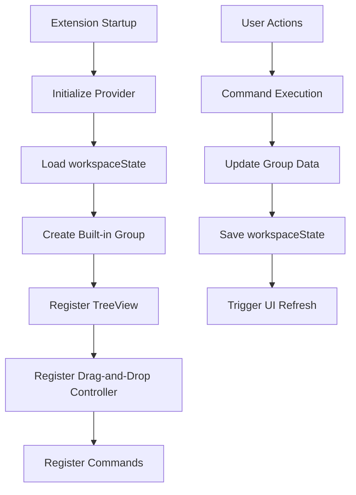
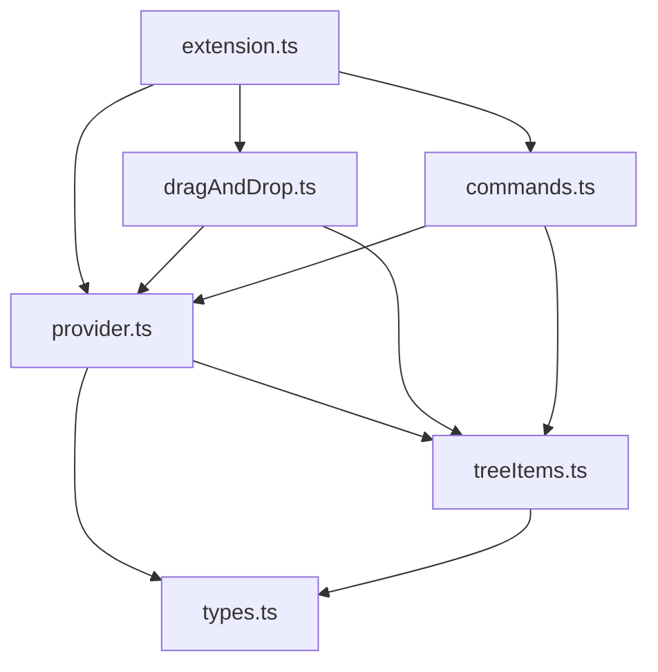
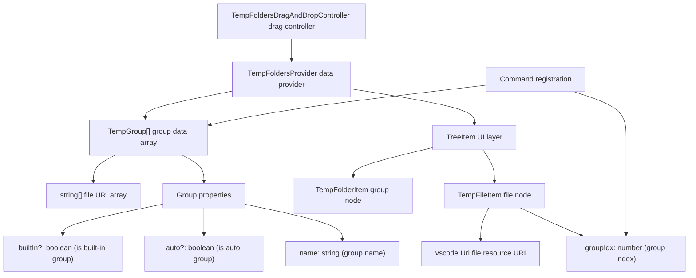

# VirtualTabs Development Guide (Virtual File Directories)

This document provides a complete guide for setting up the development environment and workflow for the VirtualTabs VS Code extension.

---

## 🛠️ Environment Setup

### System Requirements

* **Node.js** (Recommended v16 or above)
* **VS Code** (v1.75.0 or above)
* **TypeScript** (included in devDependencies)

### Setup Steps

#### 1. Project Initialization

```bash
# Clone the project and enter the directory
git clone https://github.com/winterdrive/vscode-virtual-tabs.git
cd vscode-virtual-tabs

# Install dependencies
npm install
```

#### 2. Compile TypeScript

```bash
# One-time compilation
npx tsc

# Or use npm script
npm run vscode:prepublish
```

#### 3. Start Development Mode

There are two ways to start development mode:

##### Method A: Use VS Code Debugging

1. Open the project folder in VS Code
2. Press `F5` or use the Command Palette (`Cmd+Shift+P` / `Ctrl+Shift+P`)
3. Select "Debug: Start Debugging"
4. A new Extension Development Host window will open

##### Method B: Use Command Line

```bash
# macOS/Linux
code --extensionDevelopmentPath=. --new-window

# Windows
code.cmd --extensionDevelopmentPath=. --new-window
```

#### 4. Live Development & Debugging

##### Start TypeScript Watch Mode

```bash
# Start TypeScript watch mode for auto-compilation
npx tsc --watch

# Or use VS Code tasks
# Press Cmd+Shift+P → "Tasks: Run Task" → "tsc: watch - tsconfig.json"
```

#### Reload the Extension

In the Extension Development Host window:

* Press `Cmd+R` (macOS) or `Ctrl+R` (Windows/Linux) to reload
* Or use Command Palette → "Developer: Reload Window"

#### 5. Debugging Tips

### Set Breakpoints

* Set breakpoints directly in TypeScript source code
* Breakpoints will be active after starting debug mode with F5

### View Debug Information

* Use `console.log()` to output to the Developer Console
* Check the Output panel → "Extension Host" channel
* Use VS Code's Debug Console

### Test Extension Features

1. Open some files in the Extension Development Host window
2. Check the "Virtual Tabs" view in the Explorer panel
3. Test various features (grouping, drag-and-drop, context menu, etc.)

#### Test "Send to..." (File/Group Export)

The **Send to...** feature copies selected files (or an entire group) to one or more destination folders.

* Entry points:
  * Right click a file item → **Send to...**
  * Right click a group item → **Send to... (Include Group Folder)** / **Send to... (Exclude Group Folder)**
* Quick Pick destinations:
  * **Browse**: opens a folder picker and remembers the destination under **Recent**
  * **Configured**: loads `$(rocket)` targets from `.vscode/sendTargets.json`
  * If no configured targets exist, the Quick Pick offers **Create sendTargets.json template...** (creates and opens the file)

##### `.vscode/sendTargets.json` schema

Create `.vscode/sendTargets.json` in your workspace:

```json
{
    "sendTargets": [
        {
            "name": "Production A",
            "path": "D:\\\\MachineSoftware\\\\programs"
        },
        {
            "name": "All Devices",
            "path": [
                "D:\\\\MachineSoftware\\\\programs",
                "\\\\\\\\server01\\\\share\\\\backup"
            ]
        }
    ]
}
```

---

## 🧪 Testing

The canonical reference for current test suites, commands, coverage scope,
UI/E2E constraints, fixtures, and known limitations is
[docs/TESTING.md](./docs/TESTING.md). Update that guide in the same pull
request whenever test files, commands, or requirements change.

---

## 🛠️ Technical Configuration Details

### package.json Core Configuration

```json
{
    "name": "virtual-tabs",
    "displayName": "VirtualTabs",
    "main": "./dist/extension.js",
    "engines": { "vscode": "^1.75.0" },
    "contributes": {
        "views": {
            "explorer": [{
                "id": "virtualTabsView",
                "name": "VirtualTabs (Virtual File Directories)",
                "icon": "$(tab)"
            }]
        },
        "commands": [
            // 21 registered commands, including group management, file operations, batch processing, etc.
        ],
        "menus": {
            "view/item/context": [
                // Rich context menu configuration, supports conditional display by contextValue
            ]
        }
    }
}
```

### TypeScript Compilation Configuration

```json
{
    "compilerOptions": {
        "target": "ES2020",
        "module": "commonjs",
        "outDir": "dist",
        "rootDir": "src",
        "strict": true,
        "types": ["node", "vscode"]
    }
}
```

### VS Code Development Environment Configuration

#### .vscode/launch.json

```json
{
    "configurations": [{
        "name": "Run Extension",
        "type": "extensionHost",
        "preLaunchTask": "vscode:prepublish",
        "outFiles": ["${workspaceFolder}/dist/**/*.js"]
    }]
}
```

#### .vscode/tasks.json

```json
{
    "tasks": [{
        "label": "vscode:prepublish",
        "command": "npm run vscode:prepublish",
        "group": { "kind": "build", "isDefault": true },
        "problemMatcher": ["$tsc"]
    }]
}
```

---

## 📁 Project Structure

### Directory Overview

```text
virtual-tabs/
├── .vscode/               # VS Code config files
│   ├── launch.json       # Debug configuration (preLaunchTask: vscode:prepublish)
│   └── tasks.json        # Build task configuration
│   └── sendTargets.json  # (Optional) "Send to..." configured destinations
├── dist/                 # TypeScript build output
├── assets/               # Icons and screenshots
│   ├── hero_banner.png   # Hero banner for README
│   ├── nested_groups_demo.png  # Sub-groups feature demo
│   ├── ai_context_demo.png     # AI context export demo
│   ├── copy_menu_demo.png      # Copy menu demo
│   ├── drag_drop_demo.png      # Drag and drop demo
│   ├── bookmarks_feature.png   # Bookmarks feature demo
│   └── virtualtabs_icon_*.png  # Extension icons
├── i18n/                 # Internationalization files
│   ├── en.json          # English translations
│   ├── zh-tw.json       # Traditional Chinese translations
│   └── zh-cn.json       # Simplified Chinese translations
├── src/                  # TypeScript source code
│   ├── extension.ts      # Extension entry (activate/deactivate)
│   ├── types.ts          # Data structure definitions (TempGroup, VTBookmark)
│   ├── treeItems.ts      # TreeView item definitions (TempFolderItem/TempFileItem/BookmarkItem)
│   ├── provider.ts       # TreeDataProvider implementation and group management logic
│   ├── dragAndDrop.ts    # Drag-and-drop controller (supports files, groups, directories)
│   ├── commands.ts       # VS Code command registration and implementation
│   ├── sendTo.ts         # "Send to..." destination picker + file copy logic
│   ├── i18n.ts           # Internationalization utilities
│   ├── util.ts           # UI utility (confirmation dialogs)
│   ├── index.ts          # Module export entry
│   ├── core/             # Shared business logic (single source of truth)
│   │   ├── GroupManager.ts    # Group CRUD with optimistic locking
│   │   ├── FileManager.ts     # File path validation & add/remove operations
│   │   ├── BookmarkManager.ts # Bookmark CRUD (static + instance methods)
│   │   ├── AutoGrouper.ts     # Auto-group by extension/date, sorting config
│   │   ├── FileSorter.ts      # File URI sorting (name/path/ext/date)
│   │   ├── PathUtils.ts       # Path conversion & workspace-scope validation
│   │   ├── ProjectExplorer.ts # Workspace file/folder exploration
│   │   └── index.ts           # Barrel re-export
│   └── mcp/              # MCP UI components
│       ├── McpConfigPanel.ts  # MCP config webview panel
│       └── SkillGenerator.ts  # Agent skill file generation
├── package.json          # Extension description, commands, and menu configuration
├── package.nls.json      # English localization for package.json
├── package.nls.zh-tw.json # Traditional Chinese localization
├── package.nls.zh-cn.json # Simplified Chinese localization
├── tsconfig.json         # TypeScript config
├── readme.md             # English README
├── README.zh-TW.md       # Traditional Chinese README
├── CHANGELOG.md          # Version change log
├── DEVELOPMENT.md        # Detailed development guide
├── I18N.md               # Internationalization guide
└── LICENSE               # MIT License
```

### Module Responsibilities

| Module File         | Description                                      | Main Class/Interface |
| ------------------- | ------------------------------------------------ | -------------------- |
| `extension.ts`      | Extension lifecycle management, initializes provider, drag-and-drop controller, and command registration | `activate()`, `deactivate()` |
| `provider.ts`       | Implements `TreeDataProvider`, manages group data, file operations, sub-groups, and UI updates | `TempFoldersProvider` |
| `treeItems.ts`      | Defines TreeView item classes, controls display behavior and contextValue | `TempFolderItem`, `TempFileItem`, `BookmarkItem` |
| `types.ts`          | Defines shared data structures and interfaces    | `TempGroup`, `VTBookmark`, `DateGroup` |
| `dragAndDrop.ts`    | Implements drag-and-drop controller, handles file/group/directory drag operations | `TempFoldersDragAndDropController` |
| `commands.ts`       | Registers and implements all VS Code commands, including group, file, bookmark, and clipboard operations | `registerCommands()` |
| `sendTo.ts`         | Implements "Send to..." destination picking, recent destinations, and file copy helpers | `SendToManager` |
| `i18n.ts`           | Internationalization utilities                   | `I18n` |
| `util.ts`           | UI utility: confirmation dialogs with configurable settings | `executeWithConfirmation()` |
| **`core/`**         | **Shared business logic — single source of truth for both the VS Code extension and the MCP server** | |
| `core/GroupManager`  | Group CRUD with file-based optimistic locking    | `GroupManager`, `OptimisticLockError` |
| `core/FileManager`   | File path validation, URI conversion, add/remove | `FileManager` |
| `core/BookmarkManager` | Bookmark CRUD — static methods for in-memory ops, instance methods for MCP disk I/O | `BookmarkManager` |
| `core/AutoGrouper`   | Auto-group by extension/date (6-bucket i18n-aware), sorting config | `AutoGrouper` |
| `core/FileSorter`    | File URI sorting by name, path, extension, or modified date (no vscode dependency) | `FileSorter` |
| `core/PathUtils`     | Path conversion (relative/absolute/URI) and workspace-scope validation | `PathUtils` |
| `core/ProjectExplorer` | Workspace file/folder exploration with glob filtering | `ProjectExplorer` |

### Context Menu Configuration

VirtualTabs provides rich context menu options that vary based on item type and selection state. The menu system uses `contextValue` properties and regex-based `when` clauses for precise control.

#### Item Types and Context Values

| Item Type | Context Value | Description |
|:---|:---|:---|
| Custom Group | `virtualTabsGroup` | User-created Virtual File Directories |
| Built-in Group | `virtualTabsGroupBuiltIn` | System groups (e.g., "Currently Open Files") |
| File (Custom) | `virtualTabsFileCustom` | Files in custom groups |
| File (Built-in) | `virtualTabsFileBuiltIn` | Files in built-in groups |
| Executable File | `virtualTabsFileCustomExec` / `virtualTabsFileBuiltInExec` | `.bat` or `.exe` files |
| Bookmark | `virtualTabsBookmark` | Code bookmarks |

#### Menu Availability Matrix

The following table defines the availability of commands across different item types.

| Command | Custom Group | Built-in Group | File (Custom) | File (Built-in) | Bookmark |
|:---|:---:|:---:|:---:|:---:|:---:|
| **[Group Management]** | | | | | |
| Add Group | ✔ | ✔ | ❌ | ❌ | ❌ |
| Add Sub Group | ✔ | ❌ | ❌ | ❌ | ❌ |
| Rename Group | ✔ | ❌ | ❌ | ❌ | ❌ |
| Duplicate Group | ✔ | ✔ | ❌ | ❌ | ❌ |
| Remove Group (Inline) | ✔ | ❌ | ❌ | ❌ | ❌ |
| Move Up/Down | ✔ | ❌ | ❌ | ❌ | ❌ |
| Refresh (Inline) | ❌ | ✔ | ❌ | ❌ | ❌ |
| **[File Operations]** | | | | | |
| Open All Files | ✔ | ❌ | ❌ | ❌ | ❌ |
| Close All Files | ✔ | ❌ | ❌ | ❌ | ❌ |
| Open Selected | ❌ | ❌ | ✔ | ✔ | ❌ |
| Close Selected | ❌ | ❌ | ✔ | ✔ | ❌ |
| Remove From Group (Inline) | ❌ | ❌ | ✔ | ❌ | ❌ |
| Delete File (Disk) | ❌ | ❌ | ✔ | ❌ | ❌ |
| Reveal in OS | ❌ | ❌ | ✔ | ✔ | ✔ |
| Run File (Inline) | ❌ | ❌ | ✔ (.bat/.exe) | ✔ (.bat/.exe) | ❌ |
| **[Send To...]** | | | | | |
| Send to... | ❌ | ❌ | ✔ | ✔ | ❌ |
| Send to... (Include Group Folder) | ✔ | ✔ | ❌ | ❌ | ❌ |
| Send to... (Exclude Group Folder) | ✔ | ✔ | ❌ | ❌ | ❌ |
| **[Close Operations]** | | | | | |
| Close File (Inline) | ❌ | ❌ | ❌ | ✔ `(v0.4.6)` | ❌ |
| Close Selected | ❌ | ❌ | ✔ | ✔ | ❌ |
| Close All Files | ✔ | ❌ | ❌ | ❌ | ❌ |
| **[Organization]** | | | | | |
| Sort Files Submenu | ✔ | ✔ | ❌ | ❌ | ❌ |
| Auto Group by Extension | ✔ | ✔ | ❌ | ❌ | ❌ |
| Auto Group by Date | ✔ | ✔ | ❌ | ❌ | ❌ |
| **[Copy Menu]** | | | | | |
| Copy Name | ✔ | ✔ | ✔ | ✔ | ✔ |
| Copy Context for AI | ✔ | ✔ | ✔ | ✔ | ✔ |
| Copy File Name | ✔ | ✔ | ✔ | ✔ | ✔ |
| Copy Relative Path | ✔ | ✔ | ✔ | ✔ | ✔ |
| Copy Absolute Path | ✔ | ✔ | ✔ | ✔ | ✔ |
| **[Bookmarks]** | | | | | |
| Jump to Bookmark | ❌ | ❌ | ❌ | ❌ | ✔ |
| Edit Label | ❌ | ❌ | ❌ | ❌ | ✔ |
| Edit Description | ❌ | ❌ | ❌ | ❌ | ✔ |
| Remove Bookmark (Inline) | ❌ | ❌ | ❌ | ❌ | ✔ |

#### Multi-Selection Behavior

Commands support intelligent multi-selection with the following priority:

1. **If items are pre-selected** (left-click + Ctrl/Cmd) → Process all selected items
2. **If no pre-selection** → Process the right-clicked item

**Supported multi-select commands:**

* Open Selected
* Close Selected
* Remove From Group
* All Copy Menu operations

**Example implementation pattern:**

```typescript
context.subscriptions.push(
    vscode.commands.registerCommand('virtualTabs.openSelectedFiles', async (item?: TempFileItem) => {
        let filesToOpen: TempFileItem[] = [];
        
        // Priority 1: Use selected items if available
        const selectedItems = provider.getSelectedFileItems();
        if (selectedItems.length > 0) {
            filesToOpen = selectedItems;
        } 
        // Priority 2: Use right-clicked item if no selection
        else if (item instanceof TempFileItem) {
            filesToOpen = [item];
        }
        
        if (filesToOpen.length === 0) return;
        await provider.openSelectedFiles(filesToOpen);
    })
);
```

#### Important Implementation Details

**Delete File with Trash Support:**

* Uses `vscode.workspace.fs.delete(uri, { useTrash: true })`
* Shows confirmation dialog (configurable via `virtualTabs.confirmBeforeDelete`)
* Automatically removes item from TreeView after deletion
* Files are recoverable from OS trash/recycle bin

**Copy Name vs Copy File Name:**

* **Copy Name**: Copies only the name (group name or file basename), no recursion
* **Copy File Name**: Recursively copies all file names in a group

**Bookmark Smart Group Selection:**
When adding bookmarks, the extension automatically:

1. Excludes Built-in Groups from selection
2. Auto-selects if file is in exactly 1 custom group
3. Shows picker only if file is in 2+ custom groups

#### Configuration Files

Menu configurations are defined across:

* `package.json`: Menu definitions and `when` clauses
* `src/commands.ts`: Command logic implementation
* `src/treeItems.ts`: `contextValue` assignments

### Core Data Flow


```mermaid
flowchart TD
    A[Extension Startup] --> B[Initialize Provider]
    B --> C[Load workspaceState]
    C --> D[Create Built-in Group]
    D --> E[Register TreeView]
    E --> F[Register Drag-and-Drop Controller]
    F --> G[Register Commands]
    H[User Actions] --> I[Command Execution]
    I --> J[Update Group Data]
    J --> K[Save workspaceState]
    K --> L[Trigger UI Refresh]
```

---

## 🤝 AI-Assisted Development Notes

Repository instructions and documentation ownership are indexed in
[`AGENTS.md`](./AGENTS.md). UI/E2E execution constraints belong in the
[Testing Guide](./docs/TESTING.md), and authorization for remote release
operations belongs in the [Release Policy](./docs/RELEASE_POLICY.md).

---

## ⚙️ Context Key: `virtualTabs:hasMultipleScopes`

This boolean context key controls whether the panel title **Add Group** (`+`) button is shown.

| Value | Meaning | Button |
| :--- | :--- | :--- |
| `true` | ≥2 repo scopes visible (or 0 — built-in only) | Hidden |
| `false` | Exactly 1 repo scope visible (flat mode) | Shown |

**Update points** — `updateScopeHeadersContext()` is called in three places in `provider.ts`:

1. **Constructor** — sets initial state on activation
2. **`reinitializeScopes()`** — called when Refresh is clicked or workspace folders change
3. **`setActiveScopeIds()`** — called when the scope filter changes

**Logic** (`computeHasScopeHeaders()`):

```ts
// Filtered view: check how many repo scopes are currently visible
if (this.activeScopeIds.size > 0) {
    const visibleScopes = this.configScopes.filter(s => this.activeScopeIds.has(s.id));
    return visibleScopes.length !== 1;   // 0 or 2+ → show scope headers → hide button
}
// Unfiltered: use total scope count
return this.configScopes.length > 1;
```

`package.json` wires this to the button's `when` clause:

```json
{
  "command": "virtualTabs.addGroup",
  "when": "view == virtualTabsView && !virtualTabs:hasMultipleScopes",
  "group": "navigation@3"
}
```

---

## 🔧 Common Development Issues

### Q: Compile error "Cannot find module 'vscode'"

```bash
# Make sure the correct @types/vscode version is installed
npm install --save-dev @types/vscode@^1.75.0
```

### Q: Extension does not appear in Extension Development Host

* Check if the `main` field in `package.json` points to the correct build file
* Ensure TypeScript compiles without errors
* Check Developer Tools Console for errors

### Q: Code changes are not reflected

* Make sure TypeScript has recompiled (check the `dist/` folder)
* Reload the window in Extension Development Host (`Cmd+R`)

### Q: Drag-and-drop does not work

* Ensure `dragAndDropController` is properly registered to TreeView
* Check `supportedTypes` and `dropMimeTypes` configuration
* Check Console for drag-and-drop related errors

### Q: Commands do not appear in Command Palette

* Check the `commands` configuration in `package.json`
* Ensure commands are properly registered in `commands.ts`
* Reload Extension Development Host

---

## 🔁 Data Flow & Architecture

### Module Interaction Diagram


```mermaid
flowchart TD
    extension["extension.ts"] --> provider["provider.ts"]
    extension --> dragAndDrop["dragAndDrop.ts"]
    extension --> commands["commands.ts"]
    provider --> treeItems["treeItems.ts"]
    provider --> types["types.ts"]
    dragAndDrop --> provider
    dragAndDrop --> treeItems
    commands --> provider
    commands --> treeItems
    treeItems --> types
```

### Data Flow Overview

1. `extension.ts` initializes `provider`, drag-and-drop controller, and commands on startup.
2. `provider` loads open files and groups them by extension.
3. User and UI interactions (click, drag, command) update data in `provider`.
4. After group data updates, it is automatically saved to `workspaceState` and triggers UI refresh.

### Auto-Sync of Open Files Group

To ensure the "Currently Open Files" group in VirtualTabs always reflects the actual open editors in VS Code, the extension implements an automatic synchronization mechanism. This design guarantees that any file opened or closed in the editor is immediately reflected in the Virtual Tabs tree view, without requiring manual refresh.

**Trigger Events:**

| Scenario                        | Implementation (API)                        |
|---------------------------------|---------------------------------------------|
| Editor opens a new file         | `vscode.window.onDidChangeVisibleTextEditors` |
| Editor closes a file            | `vscode.window.onDidChangeVisibleTextEditors` |
| Virtual Tabs view becomes visible | `TreeView.onDidChangeVisibility`           |
| Custom commands (e.g. group ops) | Direct call to `provider.refresh()`        |

**Design Logic:**

* On extension activation, a listener is registered for `onDidChangeVisibleTextEditors`.
* Whenever the set of visible editors changes (open/close), the provider's `refresh()` method is called.
* The `refresh()` method updates the built-in group by collecting all currently open file URIs and triggers a UI update.
* This ensures the "Currently Open Files" group is always in sync with the editor state.

**Key Implementation Points:**

* No manual refresh is needed; the tree view updates automatically.
* The mechanism is robust to all tab open/close actions, including group switching.
* Custom commands that affect group content should also call `refresh()` to maintain consistency.

**Relevant API Usage Example:**

```typescript
context.subscriptions.push(
    vscode.window.onDidChangeVisibleTextEditors(() => {
        provider.refresh();
    })
);
```

The `refresh()` method in the provider typically collects all open file URIs from the editor and updates the built-in group accordingly, then fires a tree data change event to update the UI.

### Data Structure Concept Diagram


```mermaid
flowchart TD
    %% Data Layer
    TempGroup["TempGroup[] group data array"] --> Files["string[] file URI array"]
    TempGroup --> GroupProperties["Group properties"]
    GroupProperties --> BuiltIn["builtIn?: boolean (is built-in group)"]
    GroupProperties --> Auto["auto?: boolean (is auto group)"]
    GroupProperties --> Name["name: string (group name)"]

    %% UI Layer Conversion
    TempFoldersProvider["TempFoldersProvider data provider"] --> TempGroup
    TempFoldersProvider --> TreeItems["TreeItem UI layer"]

    %% TreeItem Types
    TreeItems --> FolderItem["TempFolderItem group node"]
    TreeItems --> FileItem["TempFileItem file node"]

    %% File node properties
    FileItem --> VSCodeUri["vscode.Uri file resource URI"]
    FileItem --> GroupIndex["groupIdx: number (group index)"]

    %% Operation Layer
    DragAndDrop["TempFoldersDragAndDropController drag controller"] --> TempFoldersProvider
    Commands["Command registration"] --> TempGroup
    Commands --> GroupIndex
```

### Example Data Structure

Data structure in memory and workspaceState:

```json
const groups: TempGroup[] = [
    {
        name: "Currently Open Files",  // Group name
        files: [
            "file:///c:/project/file1.ts",
            "file:///c:/project/file2.json"
        ],
        builtIn: true  // This is a built-in group
    },
    {
        name: "TypeScript Files",  // Auto-grouped
        files: [
            "file:///c:/project/file1.ts",
            "file:///c:/project/file3.ts"
        ],
        auto: true  // This is an auto group
    },
    {
        name: "My Custom Group",  // User custom group
        files: [
            "file:///c:/project/file1.ts",
            "file:///c:/project/file2.json"
        ]
        // Not built-in or auto
    }
];
```

### UI Layer Conversion

`TempGroup` data is converted to TreeView items for VS Code display:

```typescript
// Group node (corresponds to TempGroup)
new TempFolderItem("TypeScript Files", 1, false)
    ├── new TempFileItem(Uri.file("file1.ts"), 1, false)  // File node, records group index
    └── new TempFileItem(Uri.file("file3.ts"), 1, false)  // File node, records group index
```

**Conversion Flow:**

1. `TempGroup[]` data → `TempFoldersProvider.getChildren()`
2. → `TempFolderItem` (group node) + `TempFileItem[]` (file nodes)
3. → VS Code TreeView display

---

## 🚀 Publishing & Deployment

Release channels, release-train rules, validation gates, and authorization
boundaries are defined only in
[`docs/RELEASE_POLICY.md`](./docs/RELEASE_POLICY.md). Read it in full before
planning or performing any release operation.

The implementation of automatic Marketplace and Open VSX publication lives in
[`.github/workflows/publish.yml`](./.github/workflows/publish.yml).

### Local Testing

Follow the current commands and environment constraints in
[docs/TESTING.md](./docs/TESTING.md).

### Package Extension

```bash
npm run vscode:prepublish
npx @vscode/vsce package --out virtual-tabs.vsix
```

---

## 🤝 Contribution Guide

For detailed information on how to contribute, including the development workflow, code style guidelines, and our **AI-assisted development prompts**, please read our dedicated [CONTRIBUTING.md](./CONTRIBUTING.md).

---

## 🤖 MCP Server Development

Use the module-owned [MCP server reference](./mcp-server/README.md) for the
current architecture, primitive and tool catalog, build commands, startup, and
examples. Client configuration belongs in
[docs/mcp-setup.md](./docs/mcp-setup.md), while agent operating rules and
fallback behavior belong only in
[skills/virtualtabs/SKILL.md](./skills/virtualtabs/SKILL.md).

### Contributor boundaries

- Define tool schemas and request routing in `mcp-server/src/server.ts`.
- Keep MCP handlers thin. Shared group, file, bookmark, path, and exploration
  behavior belongs in `src/core/` so the extension UI and MCP server cannot
  drift apart.
- Keep target-specific generated-skill paths in `src/mcp/SkillGenerator.ts`;
  do not mirror that path table in documentation.
- Update `mcp-server/README.md` when public server capabilities or primitives
  change.
- Update `skills/virtualtabs/SKILL.md` when agent behavior, safety rules, or
  fallback workflows change.

### Adding or changing an MCP tool

1. Add shared business logic to the appropriate class in `src/core/`.
2. Add the schema and description to `TOOL_DEFS` in
   `mcp-server/src/server.ts`.
3. Route the tool in the `CallToolRequestSchema` handler.
4. Add the thin handler method under `mcp-server/src/tools/`.
5. Update the consolidated MCP resource so clients can discover the capability.
6. Update the canonical MCP server reference and, when agent behavior changes,
   the canonical Agent Skill.
7. Add or update the relevant tests described in
   [docs/TESTING.md](./docs/TESTING.md).

---

## 📚 Resources

* [VS Code Extension API](https://code.visualstudio.com/api)
* [VS Code Extension Guidelines](https://code.visualstudio.com/api/references/extension-guidelines)
* [TreeView API Documentation](https://code.visualstudio.com/api/extension-guides/tree-view)
* [Drag and Drop API](https://code.visualstudio.com/api/references/vscode-api#TreeDragAndDropController)
* [Model Context Protocol Specification](https://modelcontextprotocol.io/docs)
* [MCP TypeScript SDK](https://github.com/modelcontextprotocol/typescript-sdk)
