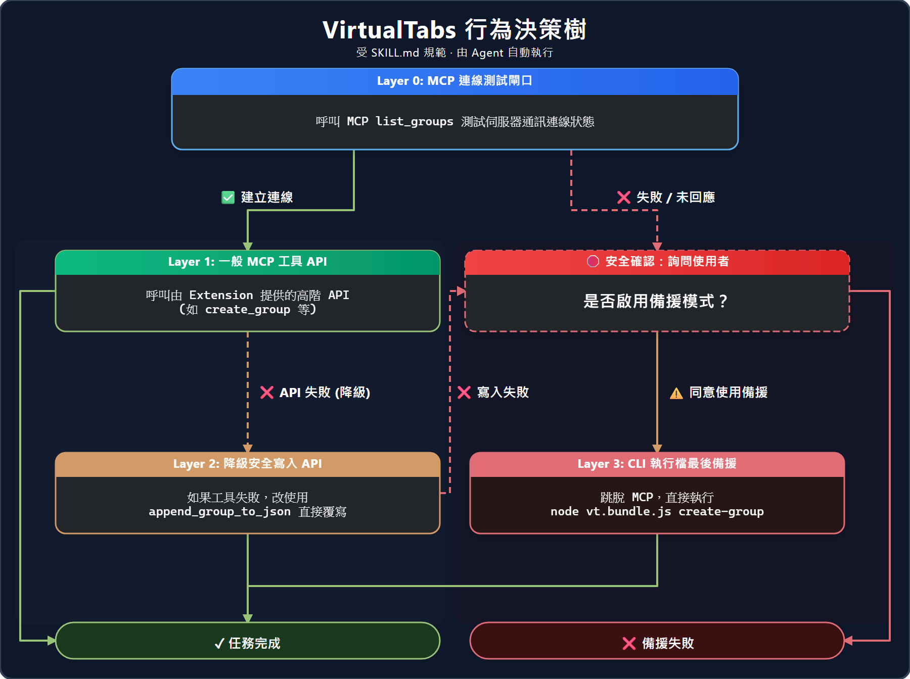

# VirtualTabs – VS Code 虛擬分頁與自定義檔案分組擴充套件

[](https://marketplace.visualstudio.com/items?itemName=winterdrive.virtual-tabs)
[](https://marketplace.visualstudio.com/items?itemName=winterdrive.virtual-tabs)
[](https://marketplace.visualstudio.com/items?itemName=winterdrive.virtual-tabs)
[](https://winterdrive.github.io/VirtualTabs/llms.txt)

繁體中文 | **[English](./README.md)**


---

## 🚀 什麼是 VirtualTabs？

**VirtualTabs 是一個 VS Code 擴充套件，在原生檔案目錄之外，提供自定義「虛擬檔案目錄」。** 不同於原生目錄，VirtualTabs 幫助您建立 **獨立的邏輯檔案群組**，可依照當前開發主題建立虛擬檔案目錄，同時也提供 **AI 就緒的編程上下文（AI-Ready Context）** 可快速複製。適合 Monorepo 專案或採用 MVVM、MVC 架構的大型專案。

---

### ⚡ VirtualTabs vs. 原生 VS Code 分頁

| 功能特點 | 原生 VS Code 分頁 | VirtualTabs 擴充套件 |
| :--- | :--- | :--- |
| **持久性** | 關閉視窗即清除 | **永久保存** (依工作區記憶) |
| **檔案分組** | 僅限資料夾結構 | **邏輯導向** (支援跨目錄) |
| **AI 上下文** | 需手動一一收集 | **一鍵生成** 給 LLM 的上下文 |


### 🧩 解決開發中的痛點

在 MVC/MVVM 或大型專案中，相關聯的檔案往往散布在多個目錄下，切換檔案非常耗時：

```text
❌ 傳統檔案結構：
├── config.json          (根目錄配置)
├── styles/theme.css     (樣式層)
├── src/components/      (元件視圖層)
└── tests/__tests__/     (測試層)

✅ 使用 VirtualTabs 建立的主題目錄：
📁 功能專題：主題系統
  ├── 📁📚 相關配置
  │   └── config.json
  ├── 📁📚 樣式定義
  │   └── theme.css
  ├── 📁📚 元件實作 (View Layer)
  │   └── ThemeProvider.tsx
  │     └── 🔖 第 45 行：Context 初始化邏輯
  └── 📁📚 單元測試 (Testing)
      └── theme.test.ts
```

---

## 🚀 快速開始 (Quick Start)

### 安裝

1. 開啟 VS Code。
2. 按 `Ctrl+Shift+X` (或 `Cmd+Shift+X`)。
3. 搜尋 **VirtualTabs** 並點擊 **安裝**。

### 首次設定

1. 點擊左側活動列中的 **VirtualTabs 圖示**。
2. 在面板中右鍵點擊 → **建立新群組**。
3. 從檔案總管將檔案 **直接拖曳** 進群組。

---

## ✨ 主要功能

### 📁 核心能力

- **跨目錄分組** — 從任何地方組織檔案，突破物理資料夾限制。
- **任務導向書籤** — 在群組中標記特定程式碼行，快速導航定位。
- **子群組與巢狀結構** — 在群組內建立群組，實現更好的層級組織。
- **AI 上下文匯出** — 一鍵複製所有檔案為 LLM 就緒的 Markdown 格式。
- **便攜設定** — 設定儲存於 `.vscode/virtualTab.json`，方便團隊共享。
- **AI Agent 整合 (MCP)** — 讓 AI 代理（Cursor、Claude 等）程序化管理您的群組。
- **自動追蹤與同步** — 自動定位作用中檔案，並與原生編緝器分組同步。
- **傳送至...** — 快速將選取的檔案或整個群組傳送到指定目的地。
- **檔案重排序** — 支援拖放或鍵盤快捷鍵進行自定義手動排序。

### ⚡ 工作流程加速

- **智慧複製選單** — 統一的檔案名稱、路徑與內容複製選項。
- **目錄拖放** — 拖曳資料夾以遞迴加入所有內部檔案。
- **剪貼簿操作** — 完整的檔案與群組剪下 / 複製 / 貼上支援。
- **智慧組織** — 依副檔名、日期自動分組，或自訂排序準則。

---

## 📖 使用指南 (User Guide)

### 📁 群組管理

- **建立/重命名**：右鍵點擊面板或群組進行管理。
- **子群組**：右鍵群組 → **新增子群組** (或將一個群組拖入另一群組)。
- **自動同步**：內建的「目前開啟的檔案」群組會自動追蹤您的分頁。
- **拖放操作**：
  - **檔案**：直接拖入群組。
  - **資料夾**：拖入資料夾可遞迴加入所有檔案。
  - **多選**：按住 `Ctrl/Cmd` 選取多個檔案後一次拖入。


### 🔖 任務導向書籤

1. 在編輯器中右鍵點擊 **任意程式碼行** → **加入書籤到 VirtualTabs**。
2. 書籤會顯示在該檔案下方。
3. 點擊即可瞬間跳轉至該行。
4. 可編輯標籤與描述，記錄 *為什麼* 這一行很重要。


### 🤖 AI 上下文匯出

**LLM 工作流的殺手級功能。**

1. 定義一個與當面任務相關的檔案群組。
2. 右鍵點擊群組 → **複製...** → **複製 AI 上下文 (Copy Context for AI)**。
3. 貼上到 ChatGPT 或 Claude。
    - **智慧**：自動跳過二進位檔；過大的檔案 (>50KB) 會幫您開啟以供檢視。
    - **整潔**：所有程式碼皆已格式化為帶有路徑的 Markdown 區塊。


---

## 🤖 智慧 AI Agent 整合 (MCP)

VirtualTabs 透過 **Model Context Protocol (MCP)** 提供完整的 AI Agent 整合。讓您的 AI 助手（Cursor, Antigravity, Kiro 等）能夠透過程式化管理您的工作區。

- 🔌 **標準化工具**：提供 15+ 工具供 AI 建立群組及探索專案。
- 🛡️ **安全性**：具備四層安全決策樹，確保 AI 不會非預期地變動物理檔案。

  

- ⚙️ **輕鬆配置**：使用 **MCP 設定面板** (命令：`VirtualTabs: Show MCP Config`) 獲取現成配置。

👉 **詳細配置請參閱 [MCP 設定指南](./docs/mcp-setup.zh-TW.md)。**

---

## 💡 最佳實踐

1. **依任務分組，而非資料夾**：專注於功能開發而非路徑。
2. **用書籤標記邏輯流程**：在代碼中的關鍵決策點標記書籤。
3. **精簡 AI 上下文**：只將必要的檔案 (5-10 個) 放入專屬群組，提升 AI 回報準確率並節省 Token。
4. **團隊共享**：提交 `.vscode/virtualTab.json` 檔案，讓團隊成員共享精選的專案視圖。

---

## ❓ 常見問題

**Q：我看不到 VirtualTabs 面板？**  
檢查擴充功能是否已啟用，且 VS Code 版本為 1.75+。查看活動列是否有 VirtualTabs 圖示。

**Q：如何將資料夾加入群組？**  
直接從檔案總管將資料夾拖曳到 VirtualTabs 面板中的群組，系統會自動遞迴掃描並加入檔案。

**Q：我可以手動調整群組順序嗎？**  
可以，右鍵點擊群組並使用 **Move Up/Down** 指令。

---

## 🤝 參與貢獻

我們熱烈歡迎社群貢獻！請查看 **[DEVELOPMENT.md](./DEVELOPMENT.md)** 了解開發環境設定與除錯指南。

- 🐞 [Bug 回報/功能建議](https://github.com/winterdrive/virtual-tabs/issues)

---

## 🔥 推薦搭配

### 🔥 Quick Prompt

**VirtualTabs 的完美夥伴。**

**VirtualTabs** 讓工作區保持整齊。**Quick Prompt** 讓你的思緒在 IDE 內保持整齊。

- **VirtualTabs**：跨任何目錄，把檔案依任務分組——持久保存，跨 session 不消失
- **Quick Prompt**：Agent 執行任務時，隨手記下下一步想法——無需切換視窗，不打斷思維流

兩者結合，大幅降低 AI 輔助開發的認知負荷。

在 [**VS Code Marketplace**](https://marketplace.visualstudio.com/items?itemName=winterdrive.quick-prompt) | [**Open VSX Registry**](https://open-vsx.org/extension/winterdrive/quick-prompt) 取得 Quick Prompt

---

## 📅 更新日誌

👉 完整版本歷史請見 [CHANGELOG.md](./CHANGELOG.md)。

---

## ❤️ 支持專案

如果您覺得這個擴充功能對您有幫助，歡迎小額贊助支持開發！

<a href="https://ko-fi.com/Q5Q41SR5WO"></a>

**授權碼**: [MIT](./LICENSE)

**更聰明地組織，更快速地編寫。** 🚀
