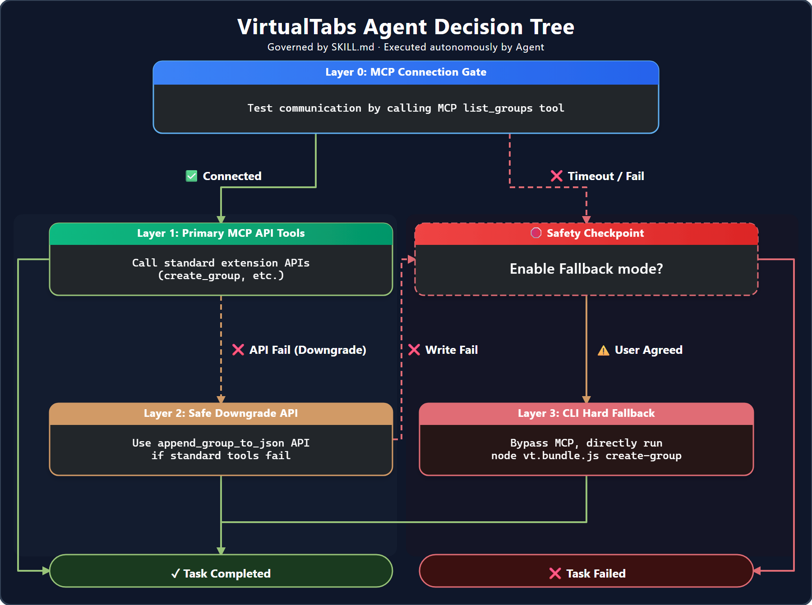

# MCP Configuration for AI Agents

This guide provides detailed instructions on how to configure the VirtualTabs MCP server in various AI-powered IDEs and agents.

## 🔌 Core Concepts

VirtualTabs ships with a fully bundled MCP server (`dist/mcp/index.js`) that exposes 15+ tools for AI agents (Cursor, Copilot, Claude, Kiro, Antigravity) to manage your workspace groups programmatically.

> [!IMPORTANT]
> **VirtualTabs groups are purely virtual.** AI tools will *never* move or modify your actual files on disk through these tools. They only manage the logical organization within the VirtualTabs UI.

---

## ⚙️ IDE Configuration Setup

Select your AI tool below to see the configuration steps:

| Cursor | Antigravity (Google) | Kiro |
|:---:|:---:|:---:|
|  |  |  |
| Configure MCP in Cursor settings | Configure MCP in Antigravity environment | Configure MCP in Kiro IDE |

### 1. Cursor Setup

1. Open **Cursor Settings** -> **Models** -> **MCP**.
2. Add a new MCP server.
3. Type: `stdio`.
4. Command: `node <absolute-path-to-extension>/dist/mcp/index.js`.
   * *Tip: Use the command `VirtualTabs: Show MCP Config` in VS Code to get the exact path ready to paste.*

### 2. Antigravity Setup

1. Open your Antigravity environment configuration.
2. Add the MCP server entry using the bundled path.

### 3. Kiro Setup

1. Navigate to Kiro's MCP integration panel.
2. Link the VirtualTabs MCP server.

---

## 🛡️ Safety & Agent Skills

VirtualTabs can generate custom "Skills" (instruction files) for your agents:
* **Cursor**: Generates `.mdc` rules.
* **Other Agents**: Generates `SKILL.md`.

Command: `VirtualTabs: Generate Agent Skill`.

The generated skill includes a **four-layer safety decision tree** to ensure the AI uses the tools correctly and safely.

---

## 📦 CLI Fallback (`vt.bundle.js`)

If the MCP protocol is unavailable in your environment, VirtualTabs provides a self-contained CLI (`dist/mcp/vt.bundle.js`) as a last-resort editing path for your AI scripts.
