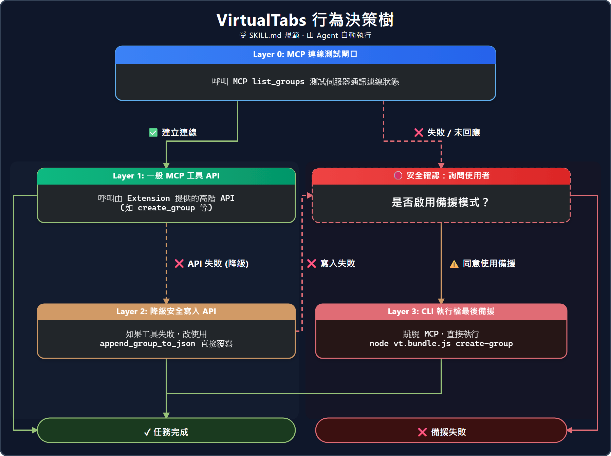

# AI Agent 的 MCP 設定指南

<!-- Translation of ./mcp-setup.md. The English source is canonical; update it first, then sync this file. -->

本指南提供如何在各種 AI 驅動的 IDE 及代理（Agent）中配置 VirtualTabs MCP 伺服器的詳細說明。

## 🔌 核心概念

VirtualTabs 內建完整打包的 MCP 伺服器 (`dist/mcp/index.js`)，讓 AI 代理（如 Cursor、Copilot、Claude、Kiro、Antigravity）能以程序化方式管理工作區群組。目前的 primitive 與工具目錄以 [MCP server reference](../mcp-server/README.md#registered-primitives) 為準。

> [!IMPORTANT]
> **VirtualTabs 的群組純屬「虛擬結構」。** AI 工具 *不會* 透過這些工具移動、修改您在磁碟上的物理檔案。它們僅管理 VirtualTabs UI 內的邏輯組織。

---

## ⚙️ IDE 配置步驟

請在下方選擇您的 AI 工具以查看配置步驟：

| Cursor | Antigravity (Google) | Kiro |
|:---:|:---:|:---:|
|  |  |  |
| 在 Cursor 設定中心配置 MCP | 在 Antigravity 環境中配置 MCP | 在 Kiro IDE 中配置 MCP |

### 1. Cursor 設定

1. 開啟 **Cursor Settings** -> **Models** -> **MCP**。
2. 新增一個 MCP 伺服器。
3. 類型：`stdio`。
4. 指令：`node <擴充功能絕對路徑>/dist/mcp/index.js`。
   * *提示：在 VS Code 中執行命令 `VirtualTabs: Show MCP Config` 可直接取得現成的絕對路徑以便貼上。*

### 2. Antigravity 設定

1. 開啟您的 Antigravity 環境設定。
2. 使用打包後的路徑新增 MCP 伺服器項目。

### 3. Kiro 設定

1. 導覽至 Kiro 的 MCP 整合面板。
2. 連結 VirtualTabs MCP 伺服器路徑。

---

## 🛡️ 安全性與 Agent 技能 (Skills)

VirtualTabs 可為您的代理生成自定義的「技能檔案」：

* **Cursor**：生成 `.mdc` 規則。
* **其他代理**：生成 `SKILL.md` 指令文檔。

執行命令：`VirtualTabs: Install Agent Skill`。選擇 **Auto Install (Recommended)** 走標準安裝流程；只有需要指定 agent 檔案時，才選 **Generate Skill Files Manually**。

安裝或生成的 skill 應遵循 [`skills/virtualtabs/SKILL.md`](../skills/virtualtabs/SKILL.md) 所定義的 canonical 行為與安全流程。

---

## 📦 CLI 後備方案 (`vt.bundle.js`)

如果您的環境暫時不支援 MCP 協定，VirtualTabs 提供一個獨立的 CLI (`dist/mcp/vt.bundle.js`)，作為您 AI 腳本的最後編輯路徑手段。
