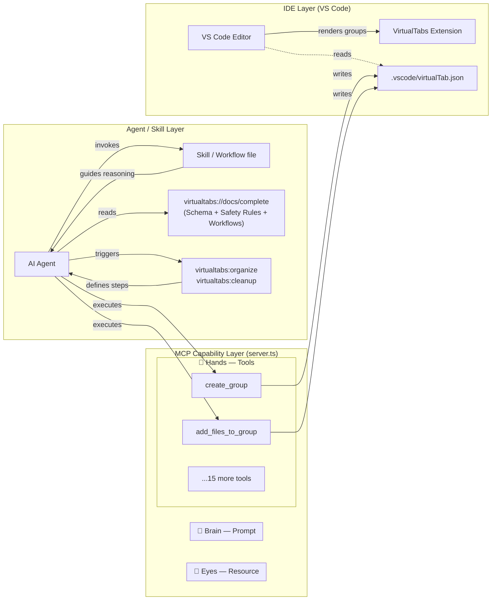

# VirtualTabs MCP Server

The Model Context Protocol (MCP) server for VirtualTabs, enabling AI agents (Cursor, GitHub Copilot, Kiro, Claude Code, Antigravity) to manage file groups programmatically through natural language.

## Architecture: Tool / Resource / Prompt

The MCP specification defines three interface primitives, each serving a distinct purpose:

| Primitive | Analogy | Triggered by | Nature | VirtualTabs Example |
|:---|:---|:---|:---|:---|
| **Tool** | 🦴 Hand — performs actions | AI decides when to call | Stateful, side-effectful | `create_group`, `add_files_to_group` |
| **Resource** | 📖 Reference book — supplies context | AI reads on demand | Read-only, static snapshot | `virtualtabs://docs/complete` |
| **Prompt** | 🧠 SOP template — encodes a workflow | User explicitly invokes | Parameterized workflow chain | `virtualtabs:organize`, `virtualtabs:cleanup` |

**One-line rule:**

> Want the AI to **do** something → **Tool** · Want the AI to **know** something → **Resource** · Want the AI to **follow a workflow** → **Prompt**



### Registered Primitives

**Tools (17)**

| Category | Tool Names |
|:---|:---|
| Group Management | `list_groups` `create_group` `rename_group` `move_group` `delete_group` |
| File Management | `add_files_to_group` `remove_files_from_group` |
| Project Exploration | `explore_project` `read_file` |
| Bookmark Management | `create_bookmark` `delete_bookmark` `list_bookmarks` |
| Auto Grouping | `set_group_sorting` `auto_group_by_extension` `auto_group_by_date` |
| Safety Fallback | `validate_json_structure` `append_group_to_json` |

**Resources (1)**

- `virtualtabs://docs/complete` — Consolidated reference containing JSON schema, safety rules, and common workflow recipes

**Prompts (2)**

- `virtualtabs:organize` — Guides the AI to reorganize groups using a specified strategy (by-feature / by-type / by-layer)
- `virtualtabs:cleanup` — Guides the AI to identify and remove invalid file references from all groups

## Features

The MCP Server exposes 17 tools covering:

- **Group Management**: Create, rename, move, and delete groups
- **File Management**: Add/remove files to/from groups
- **Project Exploration**: Search project files, read file contents
- **Bookmark Management**: Create, delete, and list bookmarks
- **Auto Grouping**: Automatically create sub-groups by extension or modification date
- **Safety Fallback Tools**: `validate_json_structure` (JSON schema validation), `append_group_to_json` (safe group append with auto-backup)

## Concurrency Safety 🔒

VirtualTabs MCP Server uses **Optimistic Locking** to protect concurrent writes to `virtualTab.json`, preventing data overwrites when multiple AI agents operate simultaneously.

**Technical details:**

- **Version checking**: Records the file's mtime (last modification time) on read; verifies the version before writing
- **Automatic conflict retry**: On conflict (`OptimisticLockError`), automatically reloads and retries up to 3 times
- **Zero external dependencies**: Uses only the Node.js standard `fs` module — no lock libraries required

This means you can:

- ✅ Use VirtualTabs simultaneously in Cursor and GitHub Copilot
- ✅ Connect multiple projects to separate MCP Server instances
- ✅ Never worry about concurrent operations corrupting your configuration

## Installation

```bash
cd editorGrouper/mcp-server
npm install
```

## Build

```bash
npm run build
```

## Start

```bash
npm start -- --workspace-root /path/to/your/workspace
```

## Development

```bash
# Watch mode (auto-recompile)
npm run watch
```

## Configuring MCP Clients

💡 **Tip:** Use the VS Code command **VirtualTabs: Show MCP Config** to view detailed, per-client configuration instructions.

Supported clients:

- **Cursor** — AI-powered code editor
- **GitHub Copilot** — VS Code AI assistant
- **Kiro** — Professional AI IDE
- **Claude Code** — Anthropic's desktop app
- **Antigravity** — Google's AI IDE

All clients require their MCP configuration file to point to the MCP Server entry point. Run the command above in VS Code for exact setup instructions.

## Agent Skill Generation

Beyond connecting an AI client to the MCP server, VirtualTabs can generate a **target-specific skill file** that teaches your AI tool exactly how to use VirtualTabs safely and effectively.

Run the VS Code command **VirtualTabs: Generate Agent Skill** to produce the skill file for your AI tool:

| AI Tool | Output File | Description |
|:---|:---|:---|
| Cursor | `.cursor/rules/virtualtabs.mdc` | Auto-loaded as an agent rule |
| GitHub Copilot | `.github/skills/virtualtabs/SKILL.md` | Agent skill for Copilot |
| Claude Code | `.claude/skills/virtualtabs/SKILL.md` | Skill for Claude Code |
| Kiro IDE | `.kiro/skills/virtualtabs/SKILL.md` | Skill for Kiro |
| Antigravity | `.agents/skills/virtualtabs/SKILL.md` | Skill for Antigravity |

Each skill file includes:

1. **CRITICAL CONCEPT block** — clarifies that VirtualTabs groups are *purely virtual* (no files are moved on disk). This prevents the most frequent agent misunderstanding.
2. **Tool catalogue** — concise reference covering all 17 MCP tools.
3. **Four-layer safety decision tree**:
   - **Layer 1** — Use standard MCP tools (preferred path).
   - **Layer 2** — Use safety tools (`validate_json_structure`, `append_group_to_json`).
   - **Layer 3** — Fall back to the bundled `vt.bundle.js` CLI.
   - **Layer 4** — Report failure to the user; do not edit JSON manually.

   
4. **Bundled `vt.bundle.js`** — a self-contained CLI written alongside the skill file during generation. Supports `list-groups`, `add-group`, `add-files`, and `remove-group`.

> **Implementation:** `src/mcp/SkillGenerator.ts` — see [DEVELOPMENT.md](../DEVELOPMENT.md#agent-skill-generation) for contributor guidelines.

---

## Real-world Examples

Below are excerpts from actual AI agent sessions demonstrating how different tools interact with VirtualTabs via MCP.

### Example 1: Cursor — Creating a Source Code Group

Cursor reads the generated `.mdc` skill file, then uses MCP tools to organize a project:

```text
Agent → list_groups()
  ← { groups: [] }   // workspace has no groups yet

Agent → create_group({ name: "Source Code" })
  ← { success: true, groupId: "abc123" }

Agent → explore_project({ pattern: "src/**/*.ts" })
  ← { files: ["src/extension.ts", "src/provider.ts", "src/commands.ts", ...] }

Agent → add_files_to_group({ groupId: "abc123", files: ["src/extension.ts", "src/provider.ts", "src/commands.ts"] })
  ← { success: true, addedCount: 3 }
```

### Example 2: Antigravity — Reading the Resource, Then Acting

Antigravity (Google's AI IDE) reads the `virtualtabs://docs/complete` resource for context, then follows the safety decision tree:

```text
Agent → read_resource("virtualtabs://docs/complete")
  ← (JSON schema, safety rules, workflow recipes)

Agent → list_groups()
  ← { groups: [{ name: "Config", files: [...] }] }

Agent → create_group({ name: "Source Code", color: "blue" })
  ← { success: true, groupId: "def456" }

Agent → explore_project({ pattern: "src/**/*.ts" })
  ← { files: ["src/index.ts", "src/server.ts", ...] }

Agent → add_files_to_group({ groupId: "def456", files: ["src/index.ts", "src/server.ts"] })
  ← { success: true, addedCount: 2 }
```

### Example 3: Cursor — Cleanup Workflow

An agent uses the `virtualtabs:cleanup` prompt to validate and clean up existing groups:

```text
Agent → list_groups()
  ← { groups: [{ name: "Legacy", files: ["old/removed.ts", "src/main.ts"] }] }

Agent → read_file({ path: "old/removed.ts" })
  ← Error: file not found

Agent → remove_files_from_group({ groupId: "legacy-id", files: ["old/removed.ts"] })
  ← { success: true, removedCount: 1 }

Agent → list_bookmarks()
  ← { bookmarks: [{ file: "src/main.ts", line: 42, label: "entry point" }] }
  // Valid bookmark retained — cleanup complete.
```

> **More examples:** See the `use_case/` directory in the repository for full interaction logs from Cursor, Antigravity, and Kiro.

---

## Project Structure

```
mcp-server/
├── src/
│   ├── index.ts           # Server entry point
│   ├── server.ts          # Core: registers Tools, Prompts, Resources, Logging, Roots
│   ├── managers/          # Thin wrappers over src/core/ (shared library)
│   ├── tools/             # MCP tool handler classes
│   └── utils/             # Utility functions (zodToJsonSchema, PathUtils)
├── dist/                  # Compiled output (bundled into dist/mcp/index.js via esbuild)
├── package.json
└── tsconfig.json
```

## License

MIT
